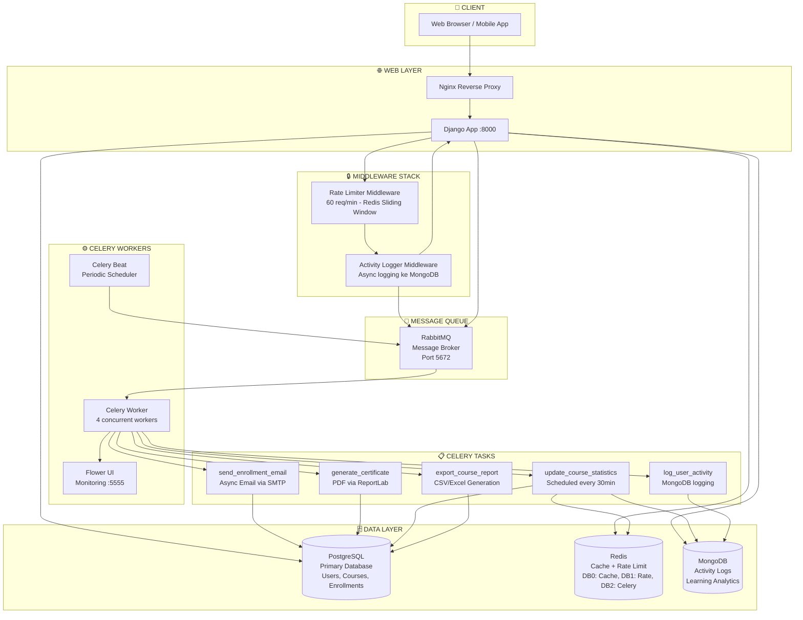

# Dokumentasi Arsitektur - LMS Advanced Features

## Architecture Diagram (Mermaid)



---

## Caching Strategy Explanation

### Pattern yang Digunakan: Cache-Aside (Lazy Loading)

```
Request → Check Cache → HIT: Return cached data
                      → MISS: Query DB → Store in Cache → Return data
```

### Cache Keys & TTL

| Resource | Cache Key | TTL | Alasan |
|----------|-----------|-----|--------|
| Course List | `lms:1:courses:list:{filters}` | 5 menit | List berubah saat ada enrollment baru |
| Course Detail | `lms:1:courses:detail:{id}` | 10 menit | Detail jarang berubah |
| Course Stats | `lms:1:courses:stats:{id}` | 30 menit | Stats diupdate periodik |
| Rate Limit | `ratelimit:{user/ip}` | 60 detik | Window per menit |

### Cache Invalidation Strategy: Targeted Invalidation

```python
# Saat course diupdate:
def invalidate_course_cache(course_id):
    # 1. Hapus detail cache
    cache.delete(f"courses:detail:{course_id}")
    # 2. Hapus statistics cache
    cache.delete(f"courses:stats:{course_id}")
    # 3. Hapus SEMUA list cache (karena list berubah)
    redis_client.delete_pattern("lms:1:courses:list:*")
```

**Mengapa Targeted (bukan Full Flush)?**
- Full flush menghapus SEMUA cache → cold start untuk semua users
- Targeted hanya hapus yang relevan → cache lain tetap warm
- Trade-off: kompleksitas vs performa

### Redis Database Segregation

```
DB 0 (default) → Application cache (course list, detail, stats)
DB 1 (rate_limit) → Rate limiting sliding window sorted sets
DB 2 (celery results) → Celery task result backend
```

---

## Task Flow Documentation

### Task 1: send_enrollment_email

```
Student klik "Enroll"
    │
    ▼
POST /api/courses/{id}/enroll/
    │
    ├─► Create Enrollment (PostgreSQL)
    ├─► Update enrollment_count
    ├─► Invalidate course cache (Redis)
    │
    └─► send_enrollment_email.delay(enrollment_id)
            │         (async, non-blocking)
            ▼
        Celery Worker
            ├─► Fetch Enrollment + Student data
            ├─► Compose email (subject + body)
            ├─► Send via SMTP (max 3 retries)
            └─► Log ke MongoDB ActivityLog
```

### Task 2: generate_certificate

```
Student selesai kursus (progress = 100%)
    │
    ▼
Trigger via signal atau API endpoint
    │
    └─► generate_certificate.delay(enrollment_id)
            │
            ▼
        Celery Worker
            ├─► Validate progress = 100%
            ├─► Generate PDF (ReportLab)
            │   ├─ Nama student
            │   ├─ Judul kursus
            │   ├─ Tanggal penyelesaian
            │   └─ Nama instruktur
            ├─► Save file ke /media/certificates/
            ├─► Update Enrollment (certificate_issued=True)
            ├─► Send email dengan PDF attachment
            ├─► Invalidate course cache (Redis)
            └─► Log ke MongoDB
```

### Task 3: update_course_statistics (Scheduled)

```
Celery Beat (setiap 30 menit)
    │
    └─► update_course_statistics.delay()
            │
            ▼
        Celery Worker
            ├─► Fetch semua published courses
            │
            └─► Untuk setiap course:
                    ├─► Hitung stats dari Enrollment (PostgreSQL)
                    │   (total, active, completed, avg_progress)
                    ├─► Update Course.enrollment_count
                    ├─► Upsert CourseAnalytics (MongoDB)
                    └─► Invalidate Redis cache (jika count berubah)
```

### Task 4: export_course_report (Async)

```
Admin/Instructor request report
    │
    ▼
POST /api/courses/{id}/report/
    │
    ├─► Response 202 Accepted + task_id (LANGSUNG, non-blocking!)
    │
    └─► export_course_report.delay(course_id, user_id, format)
            │
            ▼
        Celery Worker (5 menit timeout)
            ├─► Fetch enrollment data (PostgreSQL)
            ├─► Build data rows
            ├─► Generate file:
            │   ├─ CSV: csv.DictWriter dengan UTF-8 BOM
            │   └─ Excel: openpyxl dengan header styling
            ├─► Save ke /media/reports/
            └─► Send email notifikasi dengan download URL
```

---

## Rate Limiting Algorithm: Sliding Window

```
Request masuk → Ambil identifier (user_id atau IP)
                │
                ▼
            Redis Sorted Set: ratelimit:{identifier}
            Score = Unix timestamp, Value = timestamp string
                │
                ├─► ZREMRANGEBYSCORE: Hapus entries > 60 detik lalu
                ├─► ZADD: Tambah timestamp sekarang
                ├─► ZCARD: Hitung entries dalam window
                └─► EXPIRE: Set TTL 120 detik untuk auto-cleanup
                │
                ▼
            count <= 60? → YES → Lanjut, tambah header X-RateLimit-*
                         → NO  → Return 429, header Retry-After
```

**Keunggulan Sliding Window vs Fixed Window:**
- Fixed Window: bisa burst 120 req di batas window (60 req di akhir + 60 req di awal window baru)
- Sliding Window: selalu max 60 req dalam 60 detik terakhir, lebih akurat

---

## MongoDB Collection Design

### activity_logs
```json
{
    "_id": ObjectId,
    "user_id": 42,
    "username": "berlian",
    "action": "course_enroll",
    "resource_type": "course",
    "resource_id": 7,
    "resource_name": "Machine Learning Fundamentals",
    "ip_address": "192.168.1.100",
    "path": "/api/courses/7/enroll/",
    "method": "POST",
    "metadata": {"enrollment_id": 123, "email_sent": true},
    "timestamp": ISODate("2024-01-15T10:30:00Z")
}
```

### course_analytics
```json
{
    "_id": ObjectId,
    "course_id": 7,
    "course_title": "Machine Learning Fundamentals",
    "total_enrollments": 150,
    "active_students": 98,
    "completed_students": 45,
    "dropped_students": 7,
    "completion_rate": 30.0,
    "avg_progress": 65.5,
    "last_updated": ISODate("2024-01-15T12:00:00Z")
}
```
